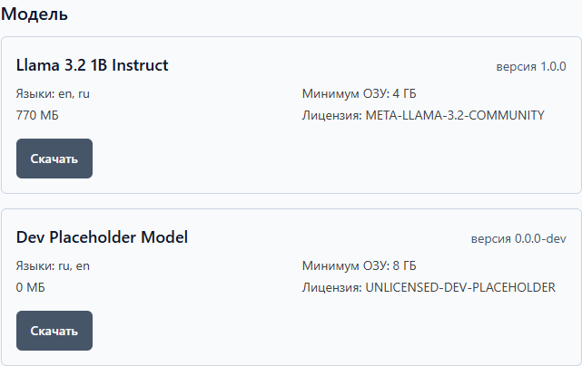

# Локальный ИИ

В Health Log есть помощник с искусственным интеллектом. Он читает ваш дневник
**прямо на вашем компьютере** и объясняет его человеческим языком. Интернет для
этого не нужен — и ваши измерения никуда не отправляются.

## Что ИИ делает

- отвечает на вопросы о ваших измерениях: «Как менялось давление?», «Чем
  отличаются утро и вечер?», «Были ли необычные значения?»;
- делает «Разбор периода» — короткое резюме выбранного отрезка дневника;
- называет вещи своими именами: если данных мало или были пропуски — скажет
  об этом прямо, а не будет додумывать.

## Чего ИИ не делает

- **не ставит диагнозы** — на вопросы «что со мной?» и «это опасно?» честно
  откажется и предложит врача;
- **не советует лекарства** — не подберёт препарат и не изменит дозу, даже если
  попросить;
- **не является медицинской консультацией** — каждый его ответ заканчивается
  этой оговоркой; это не формальность, а граница продукта;
- **не узнаёт ничего сверх дневника** — у него нет доступа к интернету и к
  файлам компьютера, только к вашим измерениям и заметкам за выбранный период.

## Почему иногда отказывается отвечать

Вопросы про лекарства, дозы и диагнозы помощник отклоняет заготовленным
ответом — это сделано специально, чтобы не выдать вредный совет. Отказ — не
поломка: переформулируйте вопрос о своих данных («Как изменилось моё давление
за месяц?») — на такие вопросы он ответит. При критических значениях с
симптомами помощник вместо ответа покажет, куда обратиться за помощью.

## Настройка: выбрать и скачать модель

Без модели разделы «ИИ» работают не полностью — приложение само подскажет.
Модель — это файл меньше гигабайта (около 800 МБ), который скачивается
**один раз** и дальше работает локально.

1. Откройте раздел «ИИ» → вкладка «Модель».
2. Посмотрите на карточки моделей: сколько места нужно (размер файла) и
   сколько памяти (ОЗУ) — «Минимум ОЗУ». Если памяти на компьютере меньше,
   чем требуется, модель может работать медленно — дневник предупредит.
3. Нажмите «Скачать» на подходящей модели. Перед загрузкой приложение спросит
   разрешение и покажет, сколько места займёт файл и откуда скачивает.
4. Дождитесь окончания загрузки и нажмите «Выбрать».
5. Готово: вкладки «Разбор» и «Чат» активны. Согласие на загрузку можно
   отозвать в «Настройки» → «Приватность».

## Примеры вопросов

- «Как менялось давление за последние 30 дней?»
- «Чем отличаются утренние и вечерние измерения?»
- «Были ли необычные значения в апреле?»
- «В какие дни я не измерял давление?»
- «Сделай разбор периода за две недели» — то же самое делает кнопка
  «Объяснить период» на вкладке «Разбор».

Перед отправкой вопроса можно открыть «Что передаётся ИИ» — вы увидите тот
самый текст с вашими данными, который получит модель, и сможете не включать
заметки.

## Если что-то не получилось

- Ответ оборвался — нажмите «Повторить» под сообщением.
- Хотите удалить историю вопросов — «Очистить чат» и «Очистить разборы» в
  соответствующих вкладках; измерения и заметки при этом останутся.
- Модель больше не нужна — «Сбросить ошибку»/выбор другой модели на вкладке
  «Модель»; файл можно удалить средствами Windows в папке моделей
  ([как найти](faq.md)).
