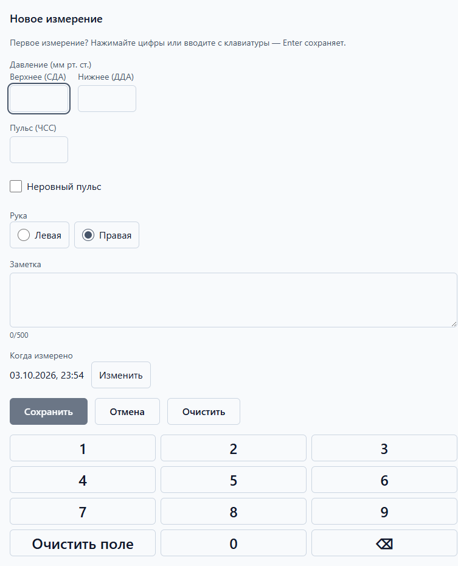
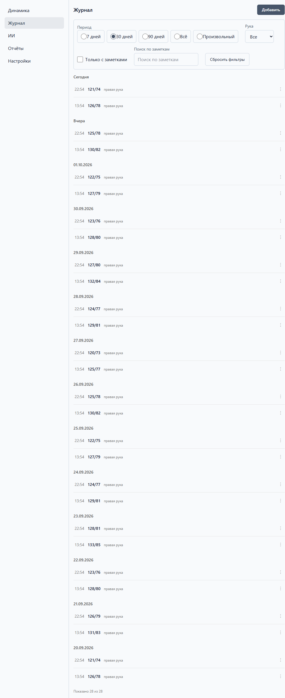
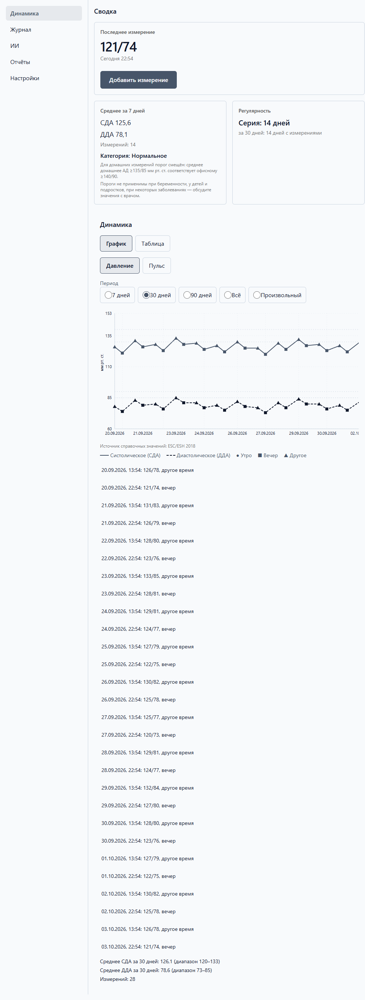

# Ежедневный дневник

Каждый день: измерили давление — внесли в дневник. На всё уходит меньше минуты.
Пропуски — это нормально: ни дневник, ни ИИ вас не ругают.

## Как измерять давление

1. Сядьте спокойно на 5 минут, спина с опорой, ноги не скрещены.
2. Манжету — на плечо на уровне сердца, не поверх одежды.
3. Измеряйте на одной и той же руке (в дневнике можно указать, какой).
4. Утро — до кофе и лекарств; вечер — перед сном, примерно в одно время.
5. Сделайте одно измерение; если сомневаетесь в результате — повторите через
   минуту и внесите тот, что кажется вернее.

*Это общие бытовые советы, а не медицинская инструкция: как именно измерять
именно вам, спросите у врача или медсестры.*

## Внести измерение

1. Откройте раздел «Журнал» и нажмите «Добавить».
2. Введите верхнее (СДА) и нижнее (ДДА) давление — большими кнопками-цифрами
   или с клавиатуры. Enter сохраняет.

   

3. По желанию: пульс, отметка «Неровный пульс», рука (левая/правая), заметка
   («после прогулки», «тревожный день» — короткими словами).
4. Нажмите «Сохранить». Запись появится в истории — сегодня сверху.

Полезно знать:

- **«Когда измерено»** — если вносите вчера вечером сегодня утром, поправьте
  время кнопкой «Изменить».
- **Ошиблись цифрой?** Наведите на запись в истории → «…» → «Изменить» или
  «Удалить».
- Отметки в истории: «!» — критическое значение, «↓» — пониженное, «~» —
  неровный пульс. Нажмите на отметку, чтобы прочитать, что она значит.
- Черновик не пропадёт: если закрыть форму не сохранившись, дневник предложит
  восстановить его в следующий раз.

## История и фильтры

1. Откройте «Журнал» — история по дням: «Сегодня», «Вчера», раньше.
2. «Показать ещё» подгружает более старые записи.
3. Фильтры сверху сужают список: период (7/30/90 дней или всё), рука, «только
   с заметками», поиск по заметкам.
4. «Сбросить фильтры» возвращает полный список.

## Динамика

1. Откройте «Динамика» — здесь график давления и главные числа.
2. Переключатель периода (7/30/90 дней) меняет окно графика.
3. Карточки показывают средние за период и регулярность — дней с измерениями
   и самой длинной серии. Без «провалов» и штрафов: пропустили неделю — просто
   продолжайте.

## Если значения насторожили

При вводе высокого значения дневник спокойно объяснит, что оно значит и когда
нужна помощь — без блокировки ввода. Коротко: от 180/120 и плохое самочувствие —
повод немедленно обратиться за медицинской помощью ([подробнее](faq.md)).
