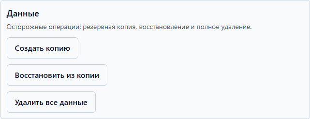

# Данные: копии и восстановление

Ваши измерения хранятся в одном зашифрованном файле на этом компьютере. Копия —
это страховка: если компьютер сломается или файл повредится, дневник можно
восстановить целиком.

## Пароль копии и пароль приложения — разные пароли

Это два **разных пароля** для двух разных вещей:

- **пароль приложения** — открывает дневник на этом компьютере ([установка](install.md));
- **пароль копии** — шифрует файл резервной копии; он нужен при восстановлении
  на этом или любом другом компьютере.

Пароль копии придумывается в момент создания копии и может отличаться от
пароля приложения. **Забыли пароль копии — данные копии невосстановимы**, даже
файл цел. Запишите пароль копии рядом с местом хранения копии.

## Создать копию

1. Откройте «Отчёты» → раздел «Данные» → «Создать копию».
2. Придумайте пароль копии (рекомендуется не короче 8 символов) и введите его
   дважды.
3. Нажмите «Создать копию» и выберите, куда сохранить файл — флешка, внешний
   диск, облачная папка. Файл имеет расширение `.hlbackup`.
4. Готово: приложение покажет имя файла. Положите копию в надёжное место —
   лучше не только на этот компьютер.

Делайте копию раз в неделю или после особенно важных записей. Дневник сам
напомнит, если копии давно не было.

## Восстановить из копии

1. Откройте «Отчёты» → «Данные» → «Восстановить из копии».
2. Выберите файл `.hlbackup` на диске.
3. Введите **пароль копии** — тот, что был задан при создании.
4. Прочитайте план восстановления: когда создана копия и сколько в ней записей.
5. Поставьте галочку «Я понимаю, что текущие данные будут заменены» и нажмите
   «Восстановить». Приложение перезапустится автоматически — это нормально.

Текущие данные будут **полностью заменены** данными копии. Если хотите сохранить
и их — сначала сделайте копию текущего дневника.

## Переезд на новый компьютер

1. На старом компьютере: создайте копию ([выше](#создать-копию)) и сохраните
   файл на флешку или в облако. Запишите пароль копии.
2. На новом компьютере: установите Health Log ([инструкция](install.md)).
3. Выберите файл копии: «Отчёты» → «Данные» → «Восстановить из копии».
4. Введите пароль копии, подтвердите — дневник целиком переедет: измерения,
   заметки, разборы.
5. Если на новом компьютере включите пароль приложения — задайте **свой новый**:
   пароль приложения со старого компьютера не переезжает.

## Полное удаление данных

Если решили закончить вести дневник и стереть всё:

1. Откройте «Отчёты» → «Данные» → «Удалить все данные».
2. Прочитайте список: база измерений, ключ шифрования, журналы приложения,
   локальные копии. Можно сначала экспортировать данные в CSV — кнопка
   «Сначала экспортировать».
3. Поставьте галочку «Я понимаю, что все данные будут безвозвратно удалены» и
   нажмите «Удалить всё». Приложение перезапустится пустым.

Удаление необратимо — перед ним стоит сделать копию «на всякий случай».

---

О безопасности в целом: [Приватность](privacy.md). И помним: **мы никогда не попросим ваш пароль в чате** или письме — пароли вводятся только в самом приложении.
