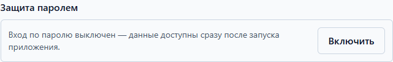

# Установка и первый запуск

Health Log — приложение для Windows 10/11. Установка занимает пару минут и не
требует прав администратора: программа ставится «для вас», в ваш профиль.

## Что понадобится

1. Компьютер с Windows 10 или 11 (64-разрядный).
2. Место на диске: установщик — около 200 МБ, плюс место для программы и данных.
3. Если планируете локальный ИИ — ещё около 800 МБ на модель ([раздел про ИИ](ai.md)).

## Установка

1. Откройте страницу релизов: <https://github.com/MonsPavel/health-log/releases/latest>.
2. Скачайте файл **Health Log Setup …exe** (установщик для Windows).
3. Запустите скачанный файл. Windows SmartScreen может спросить: «Запустить
   этот файл?» — нажмите «Подробнее» → «Выполнить в любом случае». Это обычное
   предупреждение для новых программ: файл выпущен под именем «Health Log» и
   подписан издателем.
4. Мастер установки: выберите папку (подойдёт предложенная) и нажмите
   «Установить», затем «Готово».
5. Ярлык «Health Log» появится в меню «Пуск» и на рабочем столе.

> Никогда не вводите пароль от дневника ни на каких сайтах: приложение не имеет
> веб-версии и **мы никогда не попросим ваш пароль в чате** или письме.

## Первый запуск

1. Откройте Health Log. Сначала появится окно программы — дневник готов к работе
   сразу, регистрация не нужна.
2. Первое измерение можно внести прямо сейчас: раздел «Журнал» → кнопка
   «Добавить» ([как вводить](daily.md)).

## Настройте сразу: пароль

Пароль защищает дневник при запуске и после простоя. Это ваш личный пароль
**приложения** — не путайте с паролем резервной копии, это разные пароли
([почему](data.md)).

1. Откройте «Настройки» → раздел «Защита паролем».

   

2. Нажмите «Включить», придумайте пароль и введите его дважды.
3. Поставьте галочку «Я понимаю, что без пароля данные не восстановить» и
   нажмите «Сохранить».
4. **Запишите пароль в надёжное место.** Забытый пароль сбросить нельзя —
   зашифрованные данные будут невосстановимы ([забыл пароль](faq.md)).

Там же включается **автоблокировка**: например, «5 мин» — через пять минут
бездействия дневник попросит пароль снова.

## Настройте сразу: крупный текст

Если буквы мелковаты, увеличьте их — интерфейс нарисован под три размера.

1. Откройте «Настройки» → раздел «Вид».
2. Выберите размер текста: «Обычный», «Крупный» или «Очень крупный» —
   применяется сразу, запоминать не нужно.
3. Там же можно сменить тему: «Системная», «Светлая» или «Тёмная».

## Если что-то не получилось

- Установщик не запускается — скачайте файл заново, иногда загрузка обрывается.
- Вопрос остался — загляните в [частые вопросы](faq.md).
