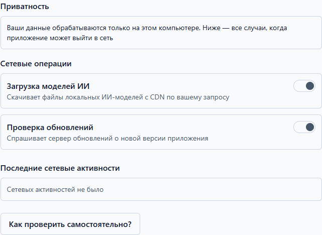

# Приватность

Health Log устроен так, что ваши данные остаются у вас: дневник работает без
интернета, измерения и заметки шифруются и не покидают компьютер. Единственные
случаи, когда приложение выходит в сеть, перечислены прямо в программе — и
каждый включается только с вашего согласия.

## Обещание

> Ваши данные обрабатываются только на этом компьютере.

Что это значит на практике:

- измерения, заметки и разборы ИИ никуда не отправляются — их нельзя «слить»,
  потому что их некому отправлять;
- база дневника зашифрована; без вашего пароля ([что за пароли](data.md)) файл
  не читается;
- в журналах приложения нет ваших измерений — там только служебные события.

## Когда приложение всё-таки выходит в сеть

Всего две операции, обе — «Настройки» → «Приватность»:

1. **Загрузка моделей ИИ** — скачивание файла модели с сервера-хранилища, когда
   вы сами нажали «Скачать» ([настройка ИИ](ai.md)). Без согласия модель
   скачать нельзя.
2. **Проверка обновлений** — приложение спрашивает сервер, вышла ли новая
   версия. Без согласия проверок не будет — вы просто не узнаете об обновлениях.

Переключатель у каждой операции включает и выключает согласие; включение
приложение подтверждает отдельным вопросом. Всё, что не в списке, в сеть не
ходит — в том числе измерения и заметки: им отправляться некуда.

## Журнал сети: что было на самом деле

Там же, ниже, — лента «Последние сетевые активности»: каждая попытка приложения
выйти в сеть попадает сюда, даже запрещённая. У каждой записи — операция,
время и исход: «успешно», «заблокировано», «ошибка», «выполняется».

## Как проверить самому

Не верьте на слово — проверьте трафик средствами Windows:

1. Нажмите Win+R, введите `resmon` и нажмите Enter — откроется «Монитор
   ресурсов».
2. Откройте вкладку «Сеть» и найдите процессы приложения (health-log / electron).
3. Сравните соединения с лентой в разделе «Приватность»: любая попытка
   приложения выйти в сеть появляется в ней — включая заблокированные.

## Диагностический пакет: что в нём

Если вы сообщаете о проблеме, приложение может собрать диагностический пакет:
версии, результаты самопроверки, журнал сети, служебные события. **Ваших
измерений и заметок в пакете нет** — перед сохранением содержимое показывается
целиком, и вы сами решаете, отправлять ли его ([нашли баг](faq.md)).
